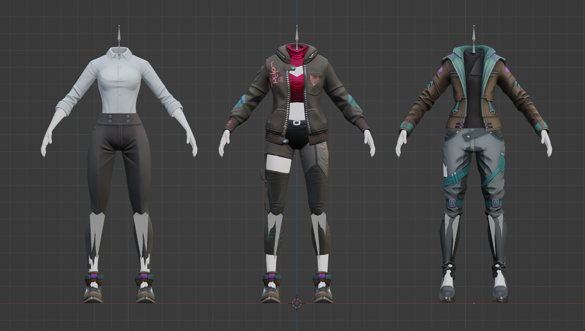

# OutfitGenerator
Export script to output randomized outfits from Blender.
This script imports all outfit FBX files from a given folder, creates a randomized full body version and exports it.
Examples can be found under "*outfit-blocks/export*"

Requirements:
* Python 3.XX
* Blender 3.5

Run OutfitGenerator from within Blender:
* open a new Blender file or the "*empty_with_script.blend*"
* when not using a provided file: open the oufitGenerator.py in Blender script editor
* edit "*import_path*" to where "*outfit-blocks*" folder is located
* edit "*batch_export*" to a desired number, this is how many outfits you want to create

Future Improvements:
* weighting between outfits
* texture randomization
* filename checker, inconsistent filenames prevent the script from working
* unique object names, gltf sub-objects are not unique and will be increment on import of multiple files

